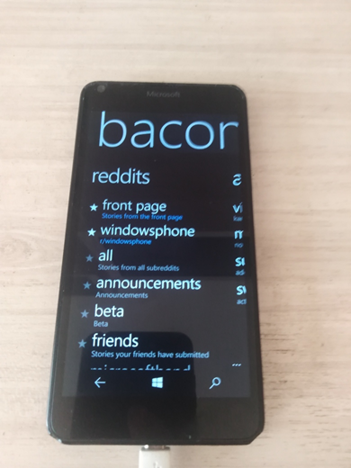
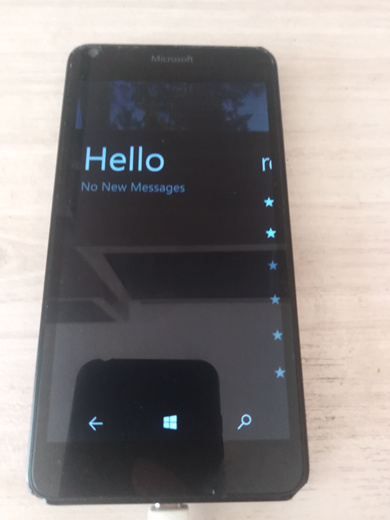
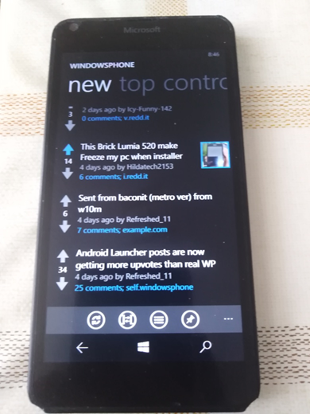
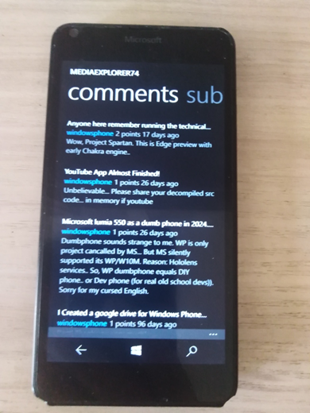

# Baconit WP8 partial decomp. + micro-RnD

## What is is?

Baconit.xap's Baconit + BaconitData "blocks" reverse-engeneering

## Screenshots

## Results

I noticed that some "old auth scheme" is still live.

## PoC

Open the PC browser. Go to some site that allows to send POST request.

Form api string:

https://ssl.reddit.com/api/login?api_type=json&user=yourusertame&passwd=yourredditpassword

Send that POST request and check the api responce "200 ok", cookie and modhash. :)

## TODO
Try to use this old sweet "cookie mechanics" for Reddit 5 project ;)))

## .
MIT License.

As is. No support. RnD only. DIY!

## ..
[m][e] 2024