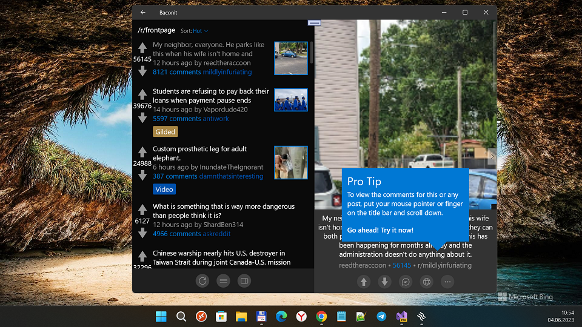
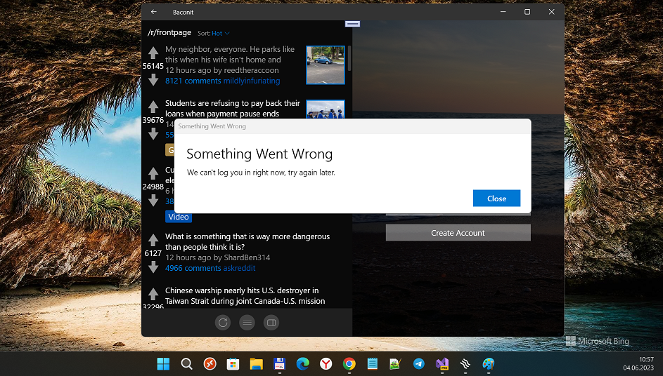
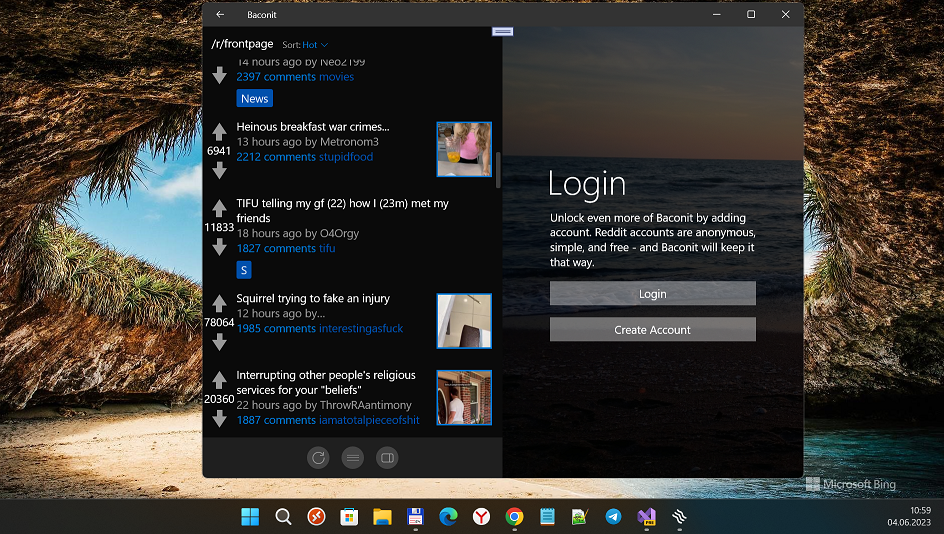

# Baconit
My fork of famous Baconit app

## About
The highest rated [r]eddit client for "very small (at 2023 year) Windows Phone family"  has been rewritten from the ground up and is now available for all W10M-contained devices. Now with a dynamic new UI, faster speeds, and features you have been asking for. Welcome to the Baconit. It's great "old new thing", indeed ;)

## Screenshots

## Tech. moments
- Target Platform Version = 10.0.19041.0
- Target Platform Min Version = 10.0.10586.0
- Mobile+Desktop UWP Extensions used
 

## TODO
- I noticed that auth manager obsolete. Try to fix Login issue.

## References
- https://github.com/QuinnDamerell Quinn Damerell, Baconit creator / (co-)developer
- https://github.com/QuinnDamerell/Baconit The original Baconit. Brave Reddit client

## .
As is. No support. RnD only. DIY!

## ..
[m][e] 2023